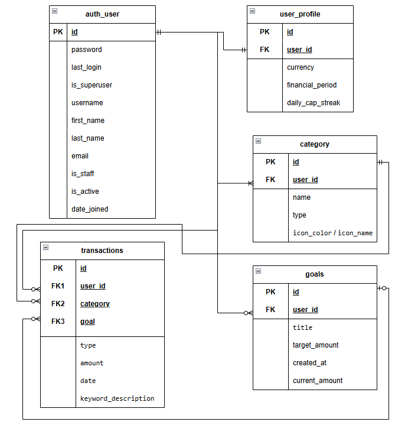
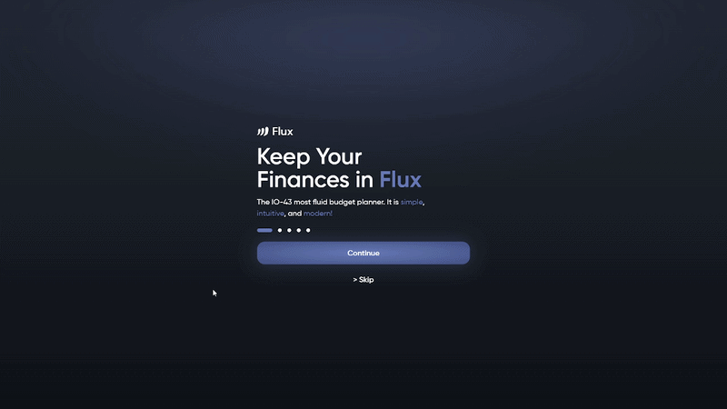
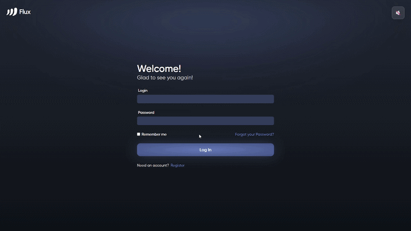
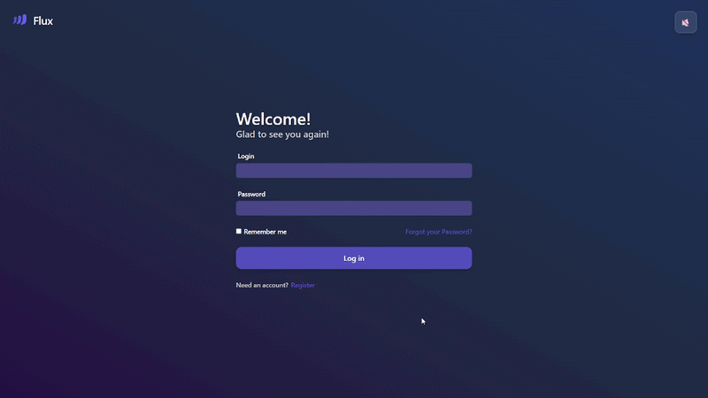

# Історія змін (Changelog)

Формат ведення історії змін версій проекту заснований на принципах [Keep a Changelog](https://keepachangelog.com/en/1.1.0/),
а сам проект дотримується принципів [Semantic Versioning](https://semver.org/spec/v2.0.0.html).

### Історія версій
- [[Unreleased] - Список змін, що не були поки занесені ні в яку версію](#unreleased)
- [[v0.0.2] - 2026-03-13: Рефакторинг архітектури: Інтеграція Zustand & UI редизайн](#v002---2026-03-13)
- [[v0.0.1] - 2026-03-02: MVP: Авторизація & Backend-інфраструктура](#v001---2026-03-02)

## [Unreleased]
- Інтегровано `SVGR` для роботи з іконками `.svg`, перетворюючи їх у React компоненти зі своїми Props 
- Реалізовано компонент навігації для мобільних пристроїв `MobileNavigation.tsx`
- Виправлено баг з некоректним відображенням логотипу та кнопки вимкнення звуку в `AuthLayout.tsx`
- Розроблено ER-діаграму, для зручного моделювання бази данних 

🖼️Переглянути ER-діаграму

 ER-діаграма для бази даних

## [v0.0.2] - 2026-03-13

### ✨Додано
- Створено файл історії змін проекту `CHANGELOG.md`
- Інтегровано **Zustand** як єдине джерело істини для стану авторизації (`useAuthStore`)
- Реалізовано реактивну перевірку токенів у `GuardSys.tsx`, що забезпечує миттєвий редирект без перезавантаження сторінки
- Реалізовано підтримку сесійної та локальної авторизації (`localStorage` / `sessionStorage`) залежно від вибору користувача
- Додано файл `CONVENTIONS.md` для визначення чітких правил розробки та ведення документації розробниками.
### 🔄Змінено
- Перероблено та оптимізовано дизайни сторінок привітання `Intro.tsx` регістрації `Register.tsx` та авторизації `Login.tsx`
- Перероблена структура `Layout` та `UI`. Тепер для більшої гнучкості, **Layout** поділяється на `mobile`, `pc` та `shared`

-------

🖼️Переглянути візуальні зміни

 

[v0.0.2] - Сторінка `Intro.tsx` та `Login.tsx`

 

[v0.0.2] - Сторінка `Register.tsx`

-------

## [v0.0.1] - 2026-03-02

### ✨Додано
- Реалізовано інтерактивну сторінку привітання `Intro.tsx`
- Створено інтерфейси для реєстрації та авторизації користувачів `Login.tsx` та `Register.tsx`
- Реалізовано серверну логіку для реєстрації / авторизації (Використано `Django`, `Django REST Framework`, `Djoser`, `Simple JWT`).
- Створено допоміжний файл `server.sh` для зручного запуску проекту з автоматичним встановленням необхідних для роботи компонентів

-------

🖼️Переглянути візуальні зміни

 

[v0.0.1] - Сторінка `Intro.tsx` та `Login.tsx`

 

[v0.0.1] - Сторінка `Register.tsx`

-------